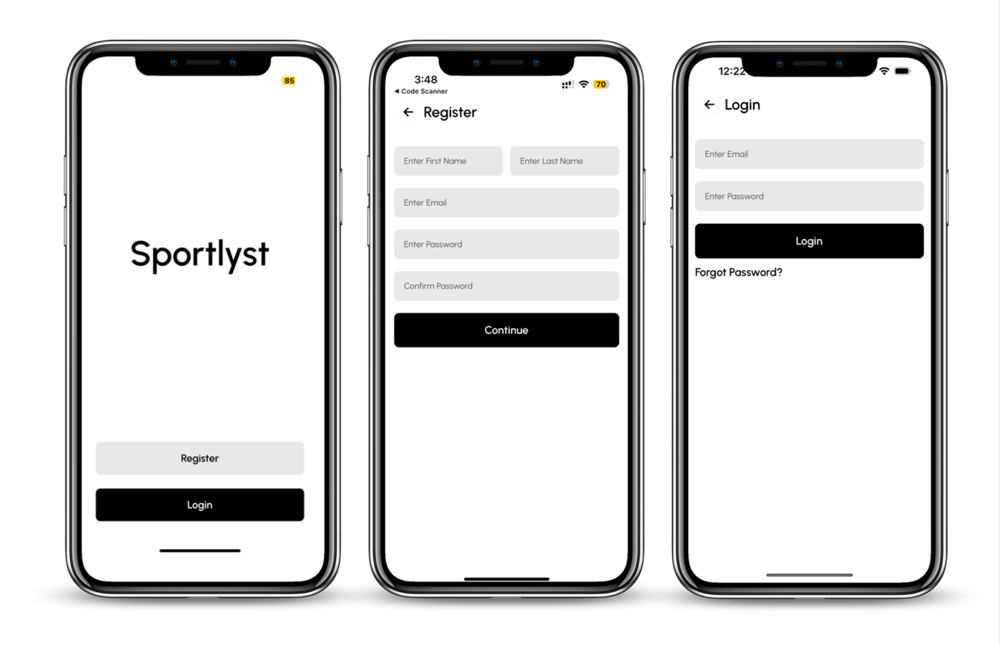
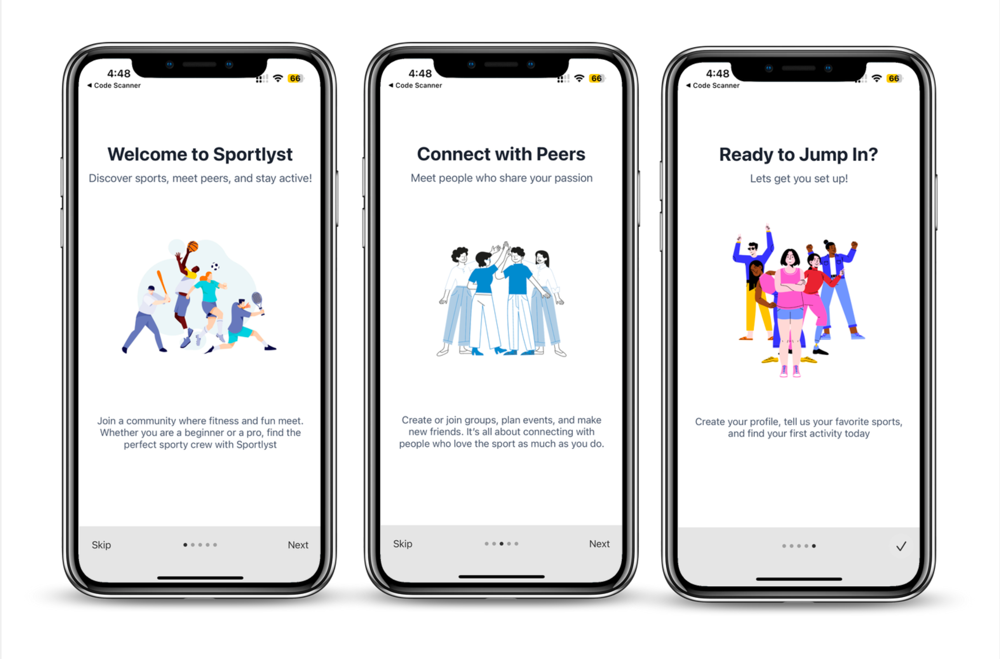
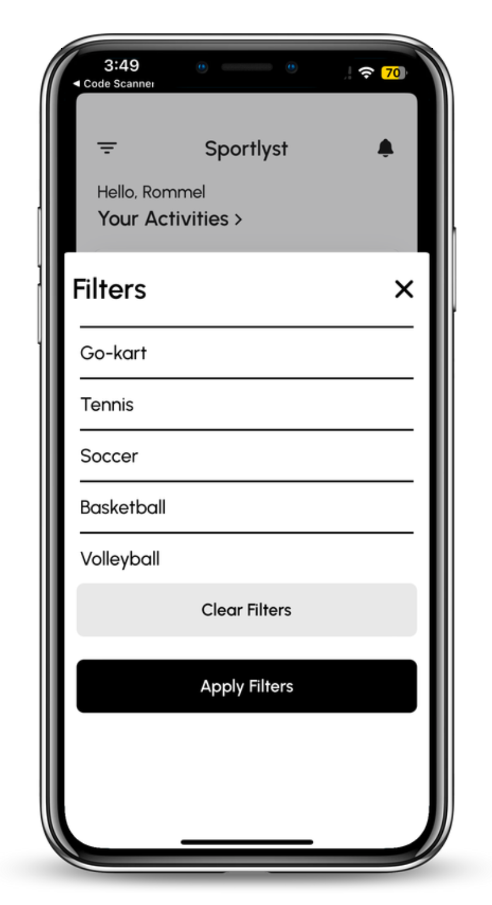
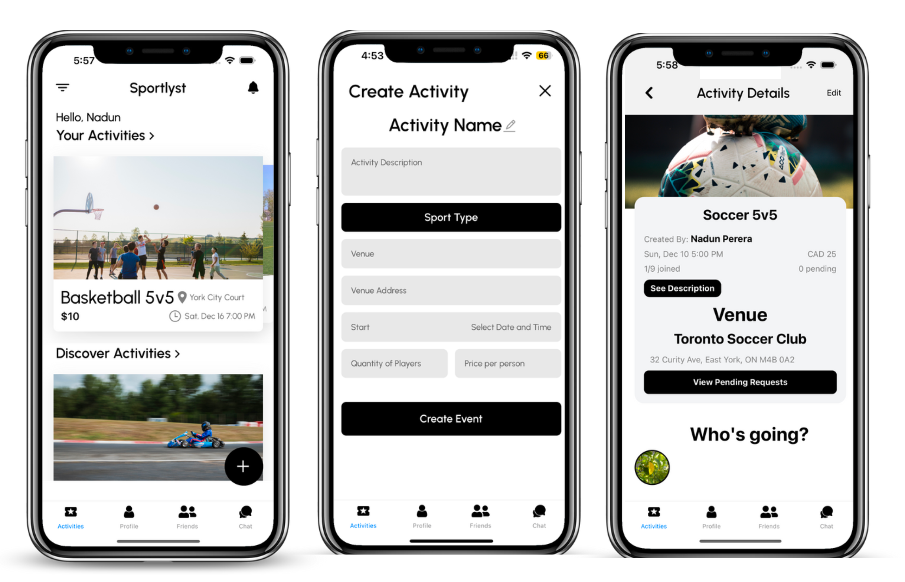
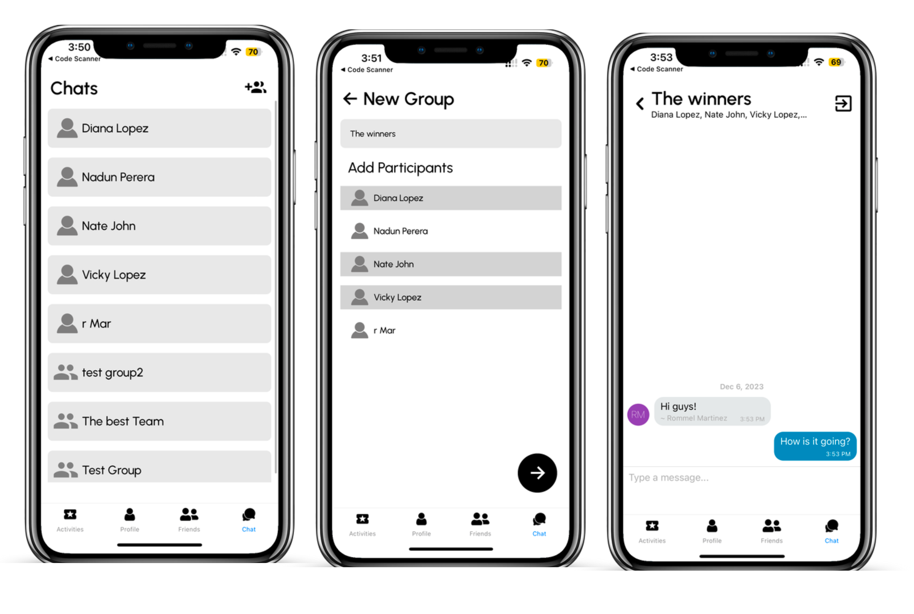

# Sportlyst

Sportlyst is a mobile app that connects sports enthusiasts with others who share an interest in playing various types of sports at local venues. Users can easily find playing partners and sports facilities, making it convenient to organize play dates and enjoy sports activities in their area.

## Features

- Intelligent Matching System: Connect with individuals in your vicinity who share similar interests in recreational activities.
- Diverse Activity Portfolio: Support for a wide range of activities including mainstream sports, hiking, and user-defined custom activities.
- Integrated Communication Platform: Seamless coordination through integrated group and personal chat features.
- Venue Recommendations: Geolocation-based suggestions for suitable venues like stadiums, parks, and community centers.
- Custom Group Creations: Create and personalize your own groups centered around shared recreational interests.
- Custom Event Creation: Host your own fitness/sports activities and invite other users to join.

## Screenshots

Here are some screenshots of the Sportlyst app:

## Technologies Used

- React Native for cross-platform mobile development
- Firebase (Firestore Database, Authentication, and Storage)
- Expo Dev for streamlined development and deployment
- App Center for automated build, test, and distribution
- Jira for project management
- GitHub for version control

## Installation

The app will be available for download on the App Store and Google Play Store. (TBD)

## Getting Started

1. Install the app from your device's app store.
2. Open the app and click on "Register" to create your account.
3. Fill in all necessary data required for account creation.
4. Once registered, you can log in and start using the app.

## Development Setup

1. Install Node.js
2. Install React Native CLI: `npm install -g react-native-cli`
3. Clone the repository: `git clone [repository-url]`
4. Install dependencies: `npm install`
5. Start Metro Builder: `npx react-native start`
6. Run the app:
   - For iOS: `npx react-native run-ios`
   - For Android: `npx react-native run-android`

## API

The Sportlyst API is built with Node.js and Express, using MongoDB. It provides endpoints for retrieving sports and venue information. The API is hosted at `https://sportlystapi.onrender.com/`.

## Contributing

Please read our [CONTRIBUTING.md](CONTRIBUTING.md) for details on our code of conduct and the process for submitting pull requests.

## Acknowledgments

- Arnoldo Bermudez
- Aayush Rattan
- Nadun Perera
- Rommel Martinez

## Contact

For any queries, please reach out to [contact email/information].
